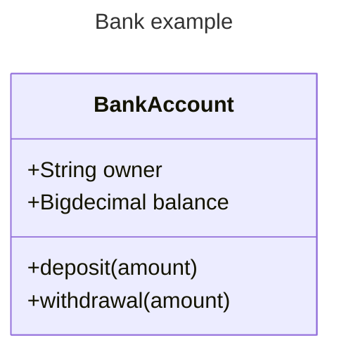

## 1. 安装依赖
```bash
npm install mermaid vitepress-plugin-mermaid -D
```

## 2. 修改配置
```js
// import { defineConfig } from 'vitepress'
import { withMermaid } from 'vitepress-plugin-mermaid'

// export default defineConfig({
//   
// })

export default withMermaid({
  // 将defineConfig下的配置内容放在此处
})
```
## 3. 示例测试
流程图：

类图：
