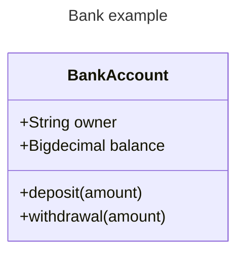

## 1. 安装依赖
```bash
npm install mermaid vitepress-plugin-mermaid -D
```

## 2. 修改配置
```js
// import { defineConfig } from 'vitepress'
import { withMermaid } from 'vitepress-plugin-mermaid'

// export default defineConfig({
//   
// })

export default withMermaid({
  // 将defineConfig下的配置内容放在此处
})
```
## 3. 示例测试
流程图：

类图：

## 4. 版本问题
项目中安装的 vitepress@2.0.0-alpha.13与 vitepress-plugin-mermaid@2.0.17 的对等依赖（peer dependency）要求不兼容  
该插件明确要求 vitepress 版本为 ^1.0.0， 因此，npm 无法解析这种冲突，导致 npm install 失败  
暂时移除 vitepress-plugin-mermaid 插件，等待后续版本更新